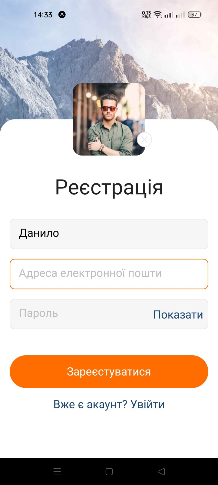
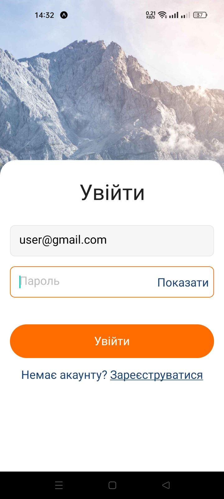
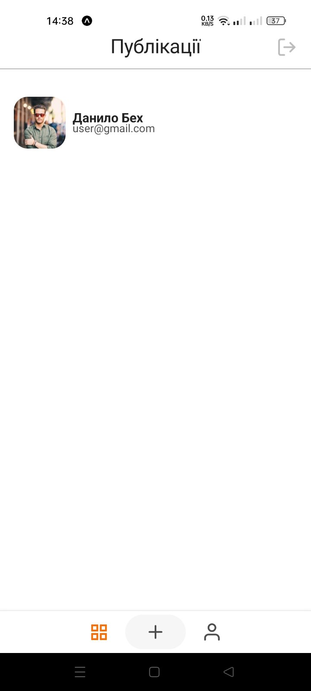
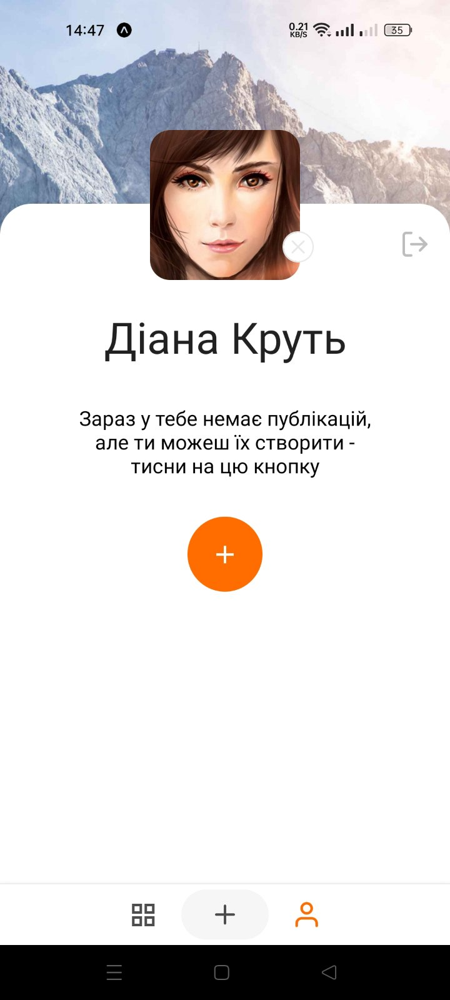
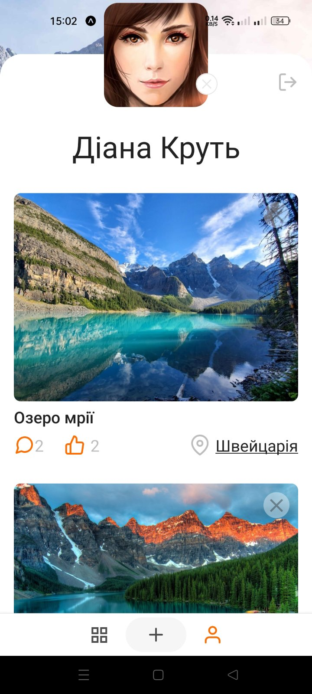
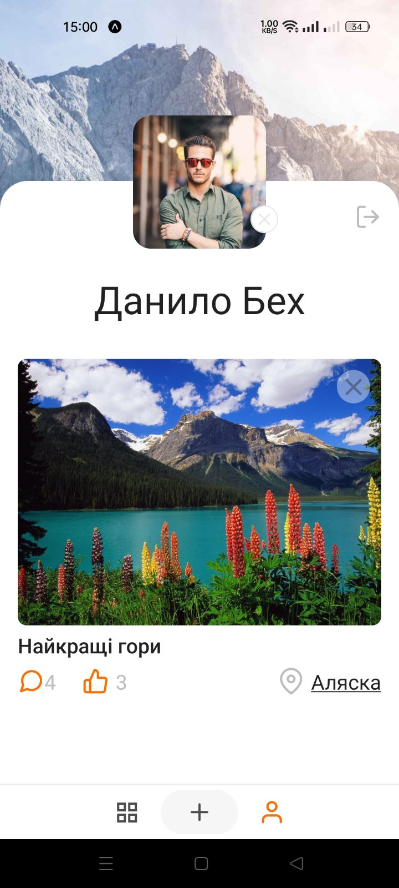
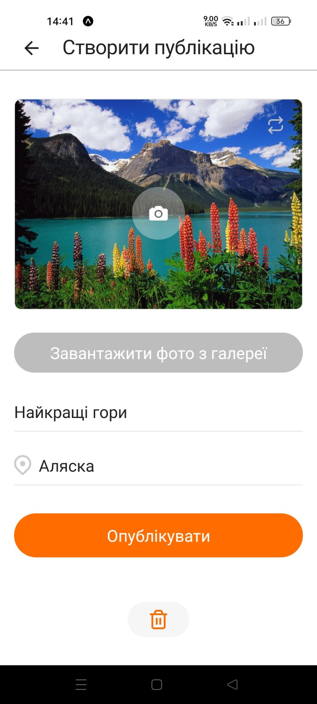
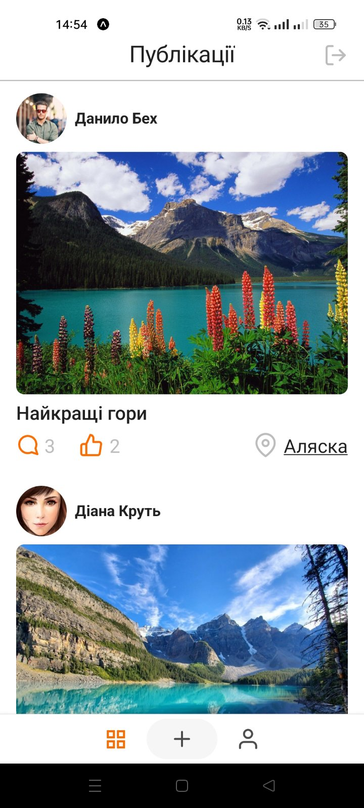
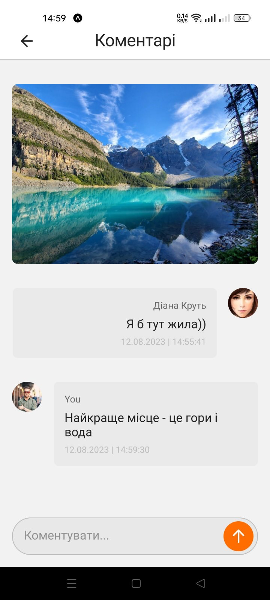

## Built With

[![Expo][Expo]][Expo-url] [![React-native][React-native]][React-native-url] [![NodeJS][Node.JS]][Node-url] [![React][Redux]][Redux-url]

[Expo]: https://img.shields.io/badge/Expo-212121?style=for-the-badge&logo=expo&logoColor=ffffff
[Expo-url]: https://docs.expo.dev/
[React-native]: https://img.shields.io/badge/-React%20Native-232a55?style=for-the-badge&logo=react&logoColor=8afadc
[React-native-url]: https://firebase.google.com/
[Node.JS]: https://img.shields.io/badge/firebase-051e34?style=for-the-badge&logo=firebase&logoColor=dd2c00
[Node-url]: https://nodejs.org/
[Redux]: https://img.shields.io/badge/Redux-20232A?style=for-the-badge&logo=Redux&logoColor=61DAFB
[Redux-url]: https://reactjs.org/

## About The Project

This app is a social networking application for uploading photos   with the ability to leave comments.  Firebase was used for this app to register/log in, as well   as to store photos, comments, etc.

## Screenshots

![Product Name Screen Shot][product-screenshot]

[product-screenshot]: ./assets/screenshots/RN-project.png

